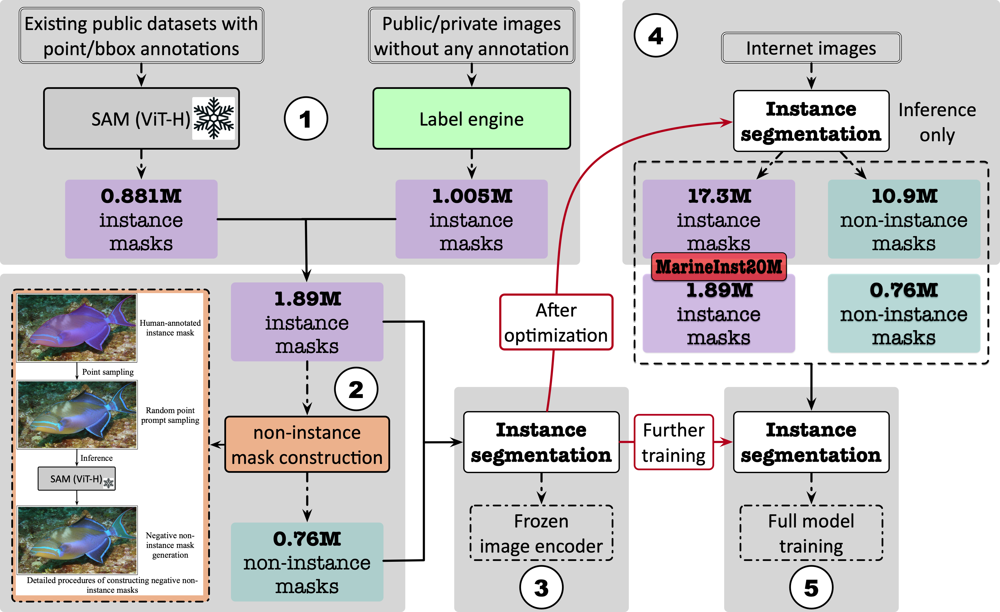
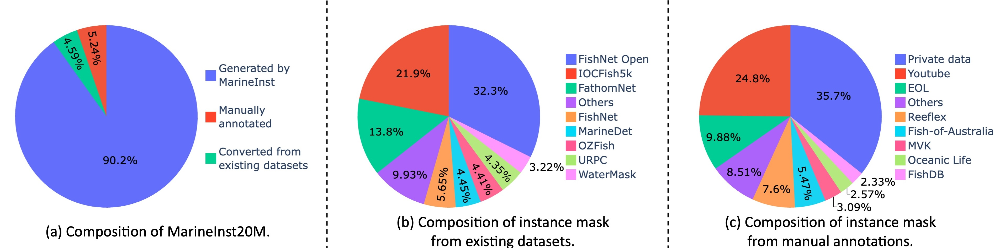

# MarineInst20M
The official dataset repository of "MarineInst: A Foundation Model for Marine Image Analysis with Instance Visual Description". ECCV 2024. 


## 📢 News

[July.10 2024] We release our MarineInst20M dataset and corresponding codes to reproduce our annotations! 

[July.2 2024] MarineInst is accepted by `ECCV 2024` with two `Strong Accept`.


## Dataset construction flow

Dataset construction flow:
<p align="center">
    </a> <br>
    Dataset construction flow of our MarineInst20M.
</p>

Dataset statistics:
<p align="center">
    </a> <br>
    Statistics of each component in our MarineInst20M.
</p>

Key Contributions:
* MarineInst20M - **First large-scale Marine dataset (million-level) with instance masks** enable marine instance description (instance segmentation + instance captioning).
* Combination of wide public marine datasets/websites (around **50 sources**) - We try our best to collect/gather the marine image dataset (with various formats of annotations) and images from public marine websites.
* Instruction-following training data - formulation of paired instance-caption to support various instruction-following understanding tasks.

Potential applications of MarineInst20M dataset:
* Scale up marine sea creature recognition.
* Biological monitoring and monitoring.
* Support a large range of downstream marine visual understanding tasks.
* Interdisciplinary research.
* More complicated systems (`instance-level visual language model`, `contrallable image synthesis`, `underwater image enhancement`, `3D reconstruction` and `video understanding`).


## The directory structure of our MarineInst20M should be this:
```
├──MarineInst20M
   ├── Flickr
       ├── Human-annotated
       └── Model-generated # image urls and annotations
   ├── Shutterstock
       ├── Human-annotated
       └── Model-generated 
   ├── Gettyimages
       ├── Human-annotated
       └── Model-generated
   ├── Private_Data # our private data and images from YouTube or Webimages
       ├── YouTube_data 
       └── Webimages
       └── ...
   ├── Public_Datasets # we convert the annotations of existing public datasets to masks
       ├── DeepFish 
       └── IOCFish5K
       └── ...
   ├── Public_Websites # we provide the urls and corresponding annotations for images from public websites
       ├── EOL
       └── FishDB
       └── ...
```

We provide corresponding `README` file under each folder to provide more information. We provide the details and corresponding jsons for constructing our MarineInst20M. Please note that we provide the instance mask annotation in `COCO RLE` format.


## Acknowledgement

+ [SAM](https://github.com/facebookresearch/segment-anything) Please check this great open-source work if you are not familiar with foundation models. We thank their contributions to the whole community.
+ [BLIP2](https://huggingface.co/docs/transformers/main/model_doc/blip-2) Please check this great open-source work if you are not familiar with VLMs!
+ [MarineGPT](https://github.com/hkust-vgd/MarineGPT) Domain-specific VLM to generate captions based on the generated instance masks. 
+ [SALT](https://github.com/anuragxel/salt) Our internal labeling tool is mainly modified from SALT. 
+ [MiniGPT-4](https://github.com/Vision-CAIR/MiniGPT-4) A powerful and open-source MLLM!

## Citation

If you find our work useful in your research, please consider citing:

```bibtex
@article{ziqiang2024marineinst,
  title={MarineInst: A Foundation Model for Marine Image Analysis with Instance Visual Description},
  author={Ziqiang Zheng, Yiwe Chen, Huimin Zeng, Tuan-Anh Vu, Binh-Son Hua, Sai-Kit Yeung},
  journal={European Conference on Computer Vision (ECCV)},
  year={2024},
  publisher={Springer}
}
```
